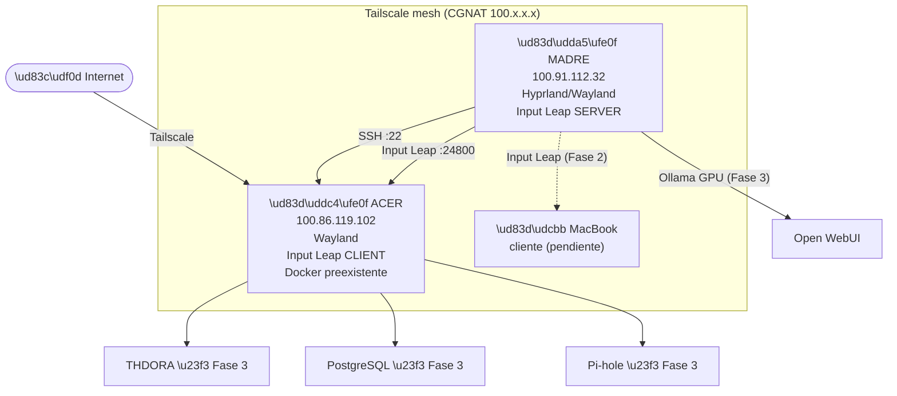

# Servidor Casa — Arquitectura y Estado

> Infraestructura doméstica de Álvaro Fernández Mota.
> 100% open source · Zero Trust · Auditado con Git
> Última actualización: 12 junio 2026

---

## Decisión de arquitectura (fijada 12 jun 2026)

**Madre es el cerebro. Acer es el soporte — dentro y fuera de casa.**

| Principio | Detalle |
|---|---|
| **Todo corre en Madre** | Trabajo, código, IAs, escritorio, GPU |
| **Acer quita peso a Madre** | Absorbe servicios que no necesitan GPU ni intervención manual |
| **Acer = acceso interno y externo** | Servicios 24/7 accesibles desde LAN y desde fuera vía Tailscale |
| **MacBook = cliente puro** | Solo consume servicios, no expone ni aloja nada |

---

## Mapa de nodos

| Máquina | IP Tailscale | Entorno gráfico | Rol Input Leap | Estado |
|---|---|---|---|---|
| **Madre** | `100.91.112.32` | Wayland / Hyprland | SERVER (teclado+ratón físicos) | ✅ Activo |
| **Acer** | `100.86.119.102` | Wayland | CLIENT (recibe control) | ✅ Activo |
| **MacBook** | pendiente | macOS | CLIENT (pendiente) | ⏳ Fase 2 |

---

## Servicios — estado real

| Servicio | Máquina | Estado | Notas |
|---|---|---|---|
| Tailscale | Madre + Acer | ✅ Fase 1 | IP mesh cifrada CGNAT |
| Input Leap server | Madre | ✅ Fase 1 | Wayland, `0.0.0.0:24800` |
| Input Leap client | Acer | ✅ Fase 1 | Apunta a `100.91.112.32:24800` |
| UFW Zero Trust | Acer | ✅ Fase 1 | Ver tabla de reglas abajo |
| Docker (preexistente) | Acer | ✅ Preexistente | Reglas UFW propias (172.x, 192.x, 53317) |
| SSH Madre → Acer | Acer | ✅ Fase 1 | Solo desde `100.91.112.32` |
| Ollama + Open WebUI | Madre (GTX 1060) | ⏳ Fase 3 | — |
| THDORA | Acer | ⏳ Fase 3 | — |
| PostgreSQL | Acer | ⏳ Fase 3 | — |
| Pi-hole | Acer | ⏳ Fase 3 | — |

---

## UFW en Acer — reglas activas

```
Política entrada: deny (por defecto)
Política salida:  allow (por defecto)

Port 22/tcp   → ALLOW IN desde 100.91.112.32 (SSH desde Madre)
Port 24800/tcp → ALLOW IN desde 100.91.112.32 (Input Leap desde Madre)

Preexistentes (Docker):
  allow-docker-dns en subredes 172.x / 192.x
  Port 53317 UDP/TCP
```

> Las reglas de Docker se mantienen intactas. No modificar sin auditar los contenedores activos.

---

## Arquitectura visual



---

## Roadmap

```
FASE 1 — Conectividad ✅ COMPLETADA (12 jun 2026)
  ✔ Tailscale en Madre (100.91.112.32) + Acer (100.86.119.102)
  ✔ SSH Madre → Acer por IP Tailscale
  ✔ Input Leap server (Hyprland/Wayland) en Madre
  ✔ Input Leap client en Acer
  ✔ UFW Zero Trust en Acer (sin romper Docker preexistente)

FASE 2 — Seguridad + sincronización
  □ TLS en Input Leap (openssl self-signed)
  □ fail2ban en Acer
  □ Headscale self-hosted (quita dependencia Tailscale cloud)
  □ Sincronización dotfiles / omarchy entre Madre y Acer
  □ Auditoría Docker preexistente en Acer
  □ MacBook como tercer nodo Input Leap

FASE 3 — Servicios
  □ Ollama + Open WebUI en Madre (GTX 1060)
  □ PostgreSQL en Acer (dockerizado)
  □ THDORA migrado a Acer
  □ Pi-hole en Acer
  □ Almacenamiento compartido (NFS o Syncthing)
```

---

## Archivos de configuración

| Archivo | Descripción |
|---|---|
| `tailscale.md` | IPs reales + instalación + fix NeedsLogin |
| `barrier.md` | Input Leap: configs systemd + UFW |
| `lan.md` | Mapa de red, IPs, puertos |

---

_Frecuencia de actualización: al cambiar configuración o estado de cualquier servicio._
