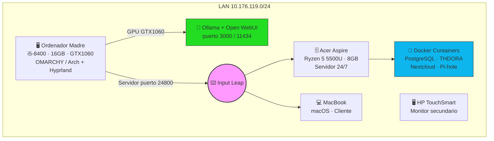

# Servidor Casa — Arquitectura y Estado

> Infraestructura doméstica de Álvaro Fernández Mota.
> 100% open source · Zero Trust · Auditado con Git
> Última actualización: 12 junio 2026

---

## Arquitectura completa



---

## Estado de servicios

| Servicio | Máquina | Estado | Archivo |
|---|---|---|---|
| **Input Leap** | Madre → Acer + Mac | ⏳ Fase 1 | `barrier.md` |
| **Ollama + Open WebUI** | Madre (GTX 1060) | ⏳ Fase 3 | `ollama.md` |
| **PostgreSQL** | Acer | 🔄 Migrando | `../servicios.md` |
| **THDORA** | Acer | 🔄 Migrando | `../../proyectos/thdora.md` |
| **Pi-hole** | Por decidir | ⏳ Fase 3 | — |
| **Nextcloud** | Acer | ⏳ Fase 3 | — |
| **WireGuard VPN** | Acer | ⏳ Futuro | — |

---

## Roadmap — Fases de construcción

```
FASE 1 — Conectividad (AHORA)
  ├── IPs fijas en router (Madre + Acer)
  ├── SSH entre Madre y Acer
  └── Input Leap funcionando con systemd + UFW

FASE 2 — Seguridad
  ├── TLS en Input Leap (openssl)
  ├── fail2ban instalado
  └── Auditoría semanal de logs (journalctl)

FASE 3 — Servicios
  ├── Ollama + Open WebUI en Madre
  ├── PostgreSQL consolidado en Acer
  ├── THDORA migrado a Acer
  └── Pi-hole en LAN
```

---

## Auditoría de logs

```bash
# Input Leap — logs en tiempo real
journalctl -u input-leap -f

# Intentos de conexión bloqueados por UFW
sudo journalctl -k | grep UFW

# Todos los servicios activos
systemctl list-units --type=service --state=running
```

> Filosofía: si no está en los logs, no sucedió. Si no está en Git, no existe.

---

## Red LAN

| Máquina | IP | Rol |
|---|---|---|
| Ordenador Madre | pendiente IP fija | Workstation + servidor Input Leap + Ollama |
| Acer Aspire | 10.176.119.171 | Servidor 24/7 |
| MacBook | 10.176.119.229 | Cliente |
| HP TouchSmart | — | Monitor secundario |

**Próximo paso crítico:** asignar IP fija a Ordenador Madre en el router.

---

## Filosofía

Ver [`/filosofia.md`](../../filosofia.md) — 100% open source, Zero Trust, todo bajo Git.
