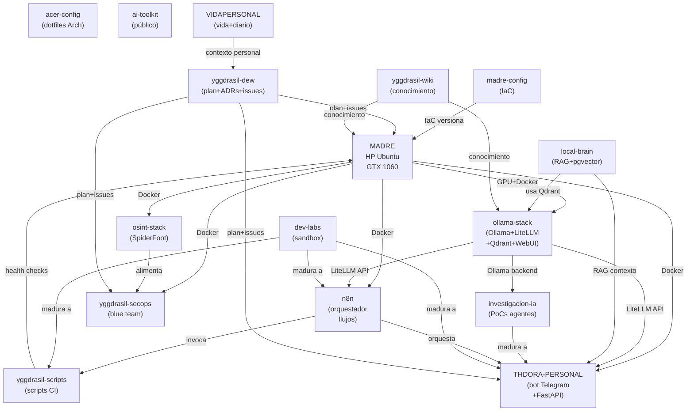

# Grafo de Dependencias — Ecosistema Yggdrasil

> Mapa completo de qué repo coge de qué repo y qué le da.
> Cada flecha = dependencia real documentada.

---

## Diagrama de dependencias (Mermaid)

---

## Tabla completa: qué coge cada repo y qué da

| Repo | Coge de | Da a | Isla wiki |
|------|---------|------|-----------|
| **MADRE** (servidor) | Electricidad + red | Todo el ecosistema (hardware) | [madre.md](islas/madre.md) |
| **madre-config** | MADRE | MADRE (versiona sus compose) | [infra.md](islas/infra.md) |
| **ollama-stack** | MADRE (GPU+Docker) | THDORA, n8n, local-brain, investigacion-ia | [ia-local.md](islas/ia-local.md) |
| **local-brain** | ollama-stack (Qdrant) | THDORA (contexto RAG) | [ia-local.md](islas/ia-local.md) |
| **THDORA-PERSONAL** | ollama-stack (LLM) + local-brain (RAG) + .env | Usuario vía Telegram | [thdora.md](islas/thdora.md) |
| **n8n** | ollama-stack (LLM) + .env | Flujos automatizados | [orquestador.md](islas/orquestador.md) |
| **yggdrasil-secops** | MADRE (Docker) + .env | Alertas Telegram + logs | [seguridad.md](islas/seguridad.md) |
| **osint-stack** | MADRE (Docker) | yggdrasil-secops (datos OSINT) | [osint.md](islas/osint.md) |
| **investigacion-ia** | ollama-stack (Ollama) | THDORA / n8n (si madura) | [investigacion-ia.md](islas/investigacion-ia.md) |
| **yggdrasil-scripts** | — | MADRE (operaciones) + n8n | [scripts.md](islas/scripts.md) |
| **dev-labs** | — | THDORA / n8n / scripts (si madura) | [dev-labs.md](islas/dev-labs.md) |
| **acer-config** | — | Acer (dotfiles) | [acer.md](islas/acer.md) |
| **formacion-tech** | — | Alvaro (conocimiento) | [formacion.md](islas/formacion.md) |
| **impresion-3d** | — | Alvaro (proyectos físicos) | [impresion3d.md](islas/impresion3d.md) |
| **yggdrasil-dew** | Todo el ecosistema | Plan + decisiones + issues | [ecosistema.md](islas/ecosistema.md) |
| **yggdrasil-wiki** | Todo el ecosistema | Conocimiento estructurado | [INDEX.md](islas/INDEX.md) |
| **VIDAPERSONAL** | Vida Alvaro | Contexto personal al DEW | [vida.md](islas/vida.md) |
| **ai-toolkit** | — | Referencia pública | [ia-local.md](islas/ia-local.md) |
| **thea-ia** | — | Decidir: archivar/integrar | [thea.md](islas/thea.md) |

---

## Reglas de dependencia del ecosistema

1. **Madre es el único servidor de producción.** Todo corre en Madre.
2. **ollama-stack es el motor de IA.** THDORA, n8n e investigacion-ia dependen de él.
3. **LiteLLM es el punto de entrada unificado.** Nadie llama directamente a Ollama excepto LiteLLM.
4. **El .env de Madre es crítico.** Si falla el .env, fallan THDORA, secops y n8n.
5. **local-brain enriquece, no sustituye.** RAG da contexto a THDORA pero no es obligatorio.
6. **El tridente (DEW+Wiki+VIDA) no tiene dependencias funcionales** — documenta y dirige, no ejecuta.
7. **dev-labs e investigacion-ia son sandboxes.** Nunca son críticos para producción.

---

_Creado: 2026-07-13 10:17 CEST · Perplexity-MCP · Cierre sesión matinal_
